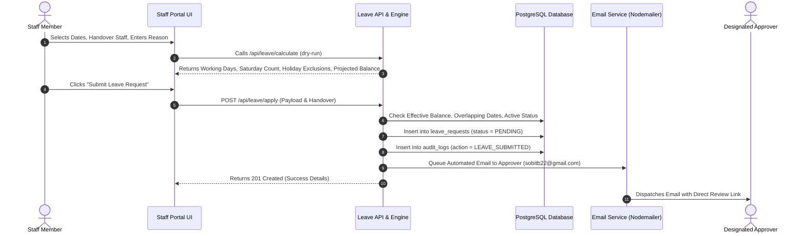
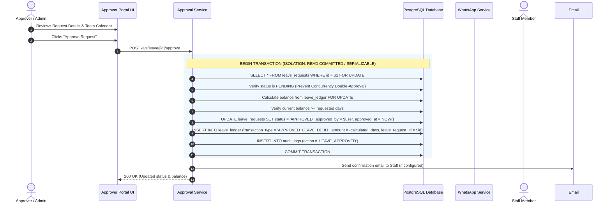

# Jaynepal Action Volunteers — Staff Leave Management Portal
## Product Requirements Document (`product.md`)

**Application Name:** JAV Staff Leave Portal  
**Target Domain:** `https://leave.jaynepal.org`  
**Organization:** Jaynepal Action Volunteers (JAV)  
**System Timezone:** `Asia/Kathmandu` (UTC+05:45)  
**Author:** Senior Product Architect & Full-Stack Engineering Team  
**Status:** Approved for Implementation  

---

## 1. Executive Summary & Product Vision
Jaynepal Action Volunteers is a community-focused non-profit organization operating in Nepal. Managing staff leaves using spreadsheets, messaging apps, or paper slips creates ambiguity, tracking errors, inaccurate leave balances, and administrative friction.

The **JAV Staff Leave Portal** is an auditable, enterprise-grade, yet simple-to-use full-stack leave management system designed specifically to handle organizational policies in Nepal. It ensures:
1. **Auditable Leave Accounting:** Using a strict double-entry-style **Leave Ledger** where balances are computed dynamically rather than stored as an unverified mutable number.
2. **Nepali Workweek & Holiday Awareness:** Automatic working-day calculations excluding **Saturdays** (standard Nepali weekend) and approved **Organization/National Holidays**.
3. **Accurate Monthly Accrual:** Predictable credit of **2.00 paid leave days per month** with idempotent processing that prevents double-crediting.
4. **Mobile-First Experience:** Accessible across smartphones (360px–430px) for field volunteers and staff with instant WhatsApp alerts for designated approvers.
5. **Strict Data Privacy:** Sensitive medical or personal reasons are protected by role-based access control (RBAC), accessible only to the employee and designated approvers.

---

## 2. User Personas & Role Matrix

| Capability | Role A: Staff / Volunteer | Role B: Approver / Manager | Role C: Organization Admin |
| :--- | :---: | :---: | :---: |
| Dedicated Login URL | `/login` | `/approver/login` | `/approver/login` |
| View Personal Leave Balance & Ledger | Yes | Yes (in profile view) | Yes |
| Submit Leave Request & Handover Assignment | Yes | Yes | Yes |
| Cancel Own Pending Request | Yes | Yes | Yes |
| View Approver Dashboard & Metrics | No (Forbidden) | Yes | Yes |
| Approve / Reject Leave with Remarks | No | Yes | Yes |
| View All Employees' Balances & Leave Days | No | Yes | Yes |
| Global Calendar View (Staff on leave) | Self Only | Yes (Privacy-Preserved) | Yes (Privacy-Preserved) |
| Manual Ledger Adjustments (Credit/Debit) | No | Yes (Audit Logged) | Yes (Audit Logged) |
| Create & Deactivate Staff Accounts | No | No | Yes |
| Manage Holidays & Calendar | No | No | Yes |
| Configure Organization Policies & Email SMTP | No | No | Yes |
| View Complete System Audit Logs | No | View relevant | Complete access |
| Retry Failed Email Notifications | No | Yes | Yes |

### Role Breakdown

#### Role A — Staff / User
- Everyday volunteer or employee of Jaynepal Action Volunteers.
- Can view their current paid leave balance, earned leave, consumed leave, pending leave, and available balance.
- Submits leave requests specifying start date, end date, designated handover colleague, reason, contact during leave, and optional attachment.
- Can track leave requests through their lifecycles (`PENDING`, `APPROVED`, `REJECTED`, `CANCELLED`).
- Strictly forbidden from viewing other staff members' balances, leave reasons, or accessing approver routes.

#### Role B — Approver
- Department heads, team leaders, or operational coordinators.
- Has an executive dashboard displaying pending leave queues, team availability, who is currently away, and upcoming departures.
- Reviews requests with full context: requested days, current balance, projected balance if approved, handover person, and reason.
- Can approve (generating transactional ledger debit) or reject (with mandatory or optional feedback).
- Can make authorized balance adjustments with mandatory administrative justification.

#### Role C — Organization Administrator
- Full governance over staff rosters, joining dates, opening balances, roles, holidays, organization settings, and audit logs.
- Can manually trigger or test the monthly accrual engine.
- Manages notification settings and SMTP credentials.

---

## 3. Core Leave Policy & Mathematical Calculation Rules

### 3.1 Monthly Paid Leave Accrual
- **Entitlement:** Each active staff member earns **2.00 days of paid leave** per active calendar month.
- **Accrual Date:** Generated on the 1st of each month (Asia/Kathmandu timezone) or upon administrative batch trigger.
- **Joining Month Rule:** New staff members only accrue leave from their designated joining month onwards. For historical balances, administrators set an audited `OPENING_BALANCE` transaction.
- **Idempotency Guarantee:** The accrual engine enforces a unique database constraint `(employee_id, accrual_year, accrual_month, transaction_type)`. Running the accrual job multiple times in a single month will never credit an employee more than once.

### 3.2 Carry Forward & Expiry
- **Default Policy:** Unused paid leave balances carry forward indefinitely to subsequent months and fiscal years.
- **No Monthly Expiry:** Balances do not expire at month-end.
- **Configurability:** An optional maximum carry-forward ceiling can be activated in organization settings without code changes.

### 3.3 Working Days & Holiday Deduction Logic
In Nepal, government, non-profit, and corporate offices follow a 6-day workweek from **Sunday through Friday**, with **Saturday** as the universal weekly rest day.
- **Weekly Rest Day:** Saturday is automatically omitted (0 leave days deducted).
- **Organization Holidays:** Any date marked active in the Organization Holiday Calendar falling between `start_date` and `end_date` is omitted.
- **Formula:**
  $$\text{Working Days} = \sum_{d = \text{start\_date}}^{\text{end\_date}} \left[ \mathbb{I}(\text{dayOfWeek}(d) \neq \text{Saturday}) \times \mathbb{I}(d \notin \text{Holidays}) \right]$$
- **Zero Working Days Validation:** If a leave request spans only a Saturday or only non-working holidays, the calculation yields 0 working days. The system rejects the submission with a clear error prompt.

### 3.4 Balance Availability & Negative Balance Prevention
- **Available Balance:** Sum of all credits minus debits in the Leave Ledger.
- **Pending Commitments:** Sum of working days across all requests currently in `PENDING` status.
- **Effective Available Balance for New Requests:**
  $$\text{Effective Available} = \text{Current Ledger Balance} - \text{Total Pending Requested Days}$$
- An employee cannot submit a leave request that exceeds their Effective Available Balance (unless negative leave is explicitly enabled in Organization Settings).

---

## 4. End-to-End Workflow Specifications

### 4.1 Leave Application Flow


### 4.2 Leave Approval Flow (Transactional)


### 4.3 Leave Rejection Flow
- Approver reviews request and enters mandatory or optional rejection remarks.
- System updates status to `REJECTED`, records `rejected_by`, `rejected_at`, and `rejection_reason`.
- **Zero ledger impact:** No debit transaction is created; the employee's pending commitment is freed up immediately.
- Creates `LEAVE_REJECTED` audit log and triggers notification.

### 4.4 Staff Cancellation Flow
- Staff member can cancel any request that is currently in `PENDING` status.
- Once approved or rejected, a staff member cannot unilaterally delete or cancel a request without administrative intervention.
- Cancellation sets status to `CANCELLED`, releases the pending hold, and writes an audit log.

---

## 5. Email Notification Specifications

### 5.1 Architecture & Fail-Safe Design
The system uses an asynchronous email notification layer via Nodemailer:
- **Primary Provider:** SMTP (e.g., Gmail with App Password or custom SMTP).
- **Decoupled Processing:** A failure to dispatch email alerts must **never** fail or roll back the leave request submission.
- **Audit Logging:** Every outbound email attempt is written to `notification_logs` with status (`QUEUED`, `SENT`, `FAILED`), payload, and diagnostics.
- **Retry Mechanism:** An administrative UI displays failed dispatches with error diagnostics and a single-click "Retry Notification" action.

### 5.2 Outbound Message Template
```text
Jaynepal Action Volunteers — Staff Leave Management
New Leave Request Awaiting Review

Employee: {{employee_name}} ({{department}})
Period: {{start_date}} to {{end_date}}
Working Days: {{leave_days}} day(s)
Handover Colleague: {{handover_name}}
Reason: {{reason_summary}}
Current Balance: {{current_balance}} days
Projected Balance: {{projected_balance}} days

Review & Action:
{{app_url}}/approver/leave/{{request_id}}
```

---

## 6. Reporting, Data Exports & Compliance
1. **Live Utilization Metrics:**
   - Total active staff count
   - Pending leave applications awaiting review
   - Staff currently on leave today
   - Approved upcoming leaves this calendar month
   - Total organization leave days taken year-to-date
2. **CSV Exports:**
   - **Staff Leave Balances:** Employee ID, Name, Department, Designation, Joining Date, Total Accrued, Total Used, Pending, Remaining Balance.
   - **Leave Requests Master Report:** Request ID, Staff ID, Name, Dates, Calculated Days, Handover Person, Status, Applied Date, Decision Date, Decision By.
   - **Leave Ledger Audit Trail:** Date, Employee, Transaction Type, Debit/Credit Amount, Running Balance, Reference Notes.
3. **Data Retention & Audit Trail:**
   - All ledger entries and audit records are immutable.
   - Hard deletion of employees or approved requests is prevented to ensure compliance with Nepali labor practices and audit standards.
